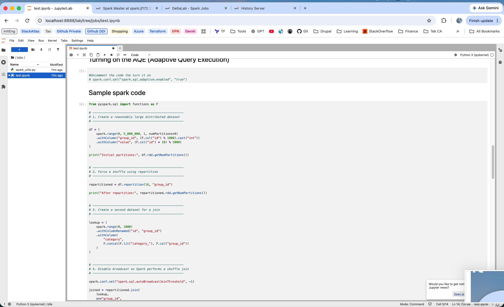
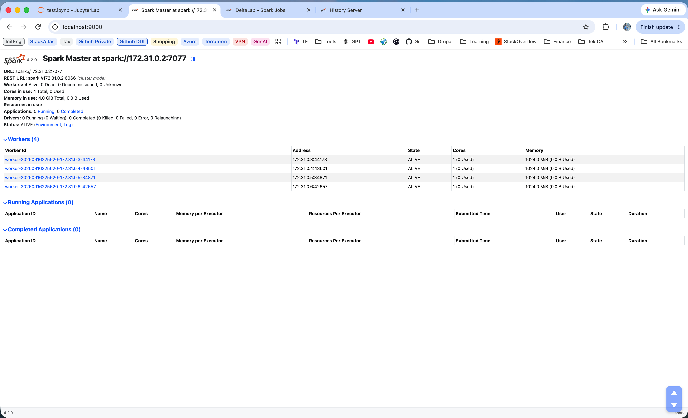
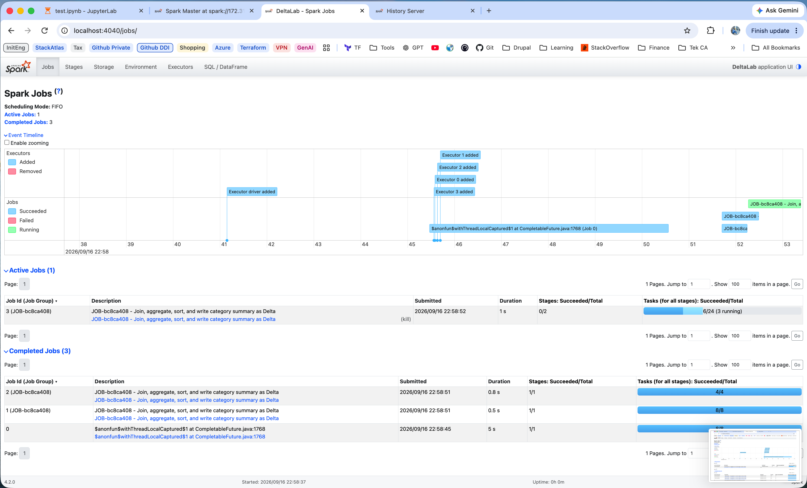
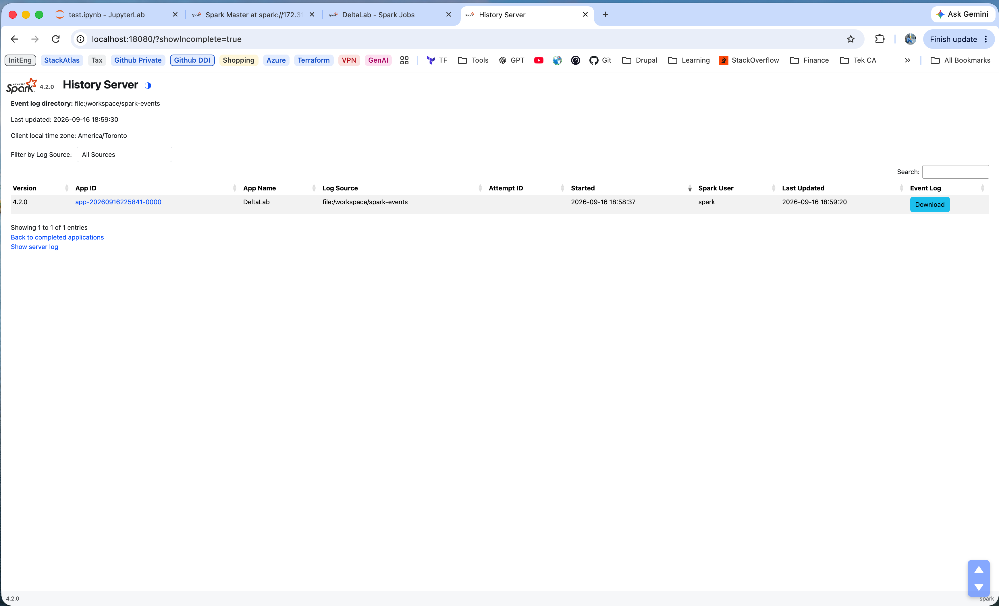

# Tiny Spark Docker Cluster

A lightweight local **Apache Spark 4.2.0** standalone cluster built with Docker for hands-on learning and experimentation.

The goal of this project is to make Spark internals easy to observe on a small machine without requiring large production-scale datasets.

## Capabilities

The cluster includes:

- **1 Spark Master**
- **4 Spark Workers**
- **JupyterLab** for interactive PySpark development
- **Delta Lake** support
- **Adaptive Query Execution (AQE)** experiments
- **Live Spark UI** for jobs, stages, tasks, executors, and SQL plans
- **Spark History Server** with persisted event logs
- Local `jobs/`, `data/`, and `spark-events/` folders mounted directly into the cluster

It is designed to help you understand how Spark executes workloads:

```text
DataFrame operations
        ↓
Spark Jobs
        ↓
Stages
        ↓
Tasks
        ↓
Executors
        ↓
Worker CPU / Memory
```

## Ideal for experimenting with

- Partitions
- Repartition / Coalesce
- Shuffles
- Joins
- Broadcast Joins
- Sort-Merge Joins
- Aggregations
- Data Skew
- Salting
- AQE
- Caching
- Executor Memory
- Executor Cores
- Delta Tables
- Delta Transaction Logs
- Spark Job Groups
- Spark History

## What You Need

Install:

- Docker Desktop
- Git

Clone the repo:

```bash
git clone git@github.com:GurmanGill/spark_cluster.git
cd spark_cluster
```

Build and start everything:

```bash
docker compose up -d --build
```

Check the containers:

```bash
docker compose ps
```

Expected containers:

```text
spark-master
spark-worker-1
spark-worker-2
spark-worker-3
spark-worker-4
```

Stop the cluster:

```bash
docker compose down
```

## Open the UIs

| UI                   | URL                    | Purpose                                        |
| -------------------- | ---------------------- | ---------------------------------------------- |
| JupyterLab           | http://localhost:8888  | Run notebooks                                  |
| Spark Master UI      | http://localhost:9000  | Workers, cores, memory, applications           |
| Spark Driver UI      | http://localhost:4040  | Live jobs, stages, tasks, executors, SQL plans |
| Spark History Server | http://localhost:18080 | Persisted Spark application history            |

Port `4040` becomes available after the notebook creates a `SparkSession`.

### Jupyter Notebook

<p align="center">
  
</p>

### Spark Cluster UI

<p align="center">
  
</p>

### Spark Jobs and Stages

<p align="center">
  
</p>

### Spark History Server

<p align="center">
  
</p>

## Repo Layout

```text
spark_cluster/
├── Dockerfile
├── docker-compose.yml
├── requirements.txt
├── start-master.sh
├── jobs/
│   ├── test.ipynb
│   └── spark_utils.py
├── data/
├── spark-events/
└── img/
```

The local folders are mounted directly into the containers:

```text
Local repo                 Docker

./jobs         <------->   /workspace/jobs
./data         <------->   /workspace/data
./spark-events <------->   /workspace/spark-events
```

This means notebook/code changes, datasets, Delta-table files, and Spark event logs are stored directly in the local repository and survive container recreation.

## Sample Notebook

Open:

```text
http://localhost:8888
```

Then open:

```text
jobs/test.ipynb
```

The notebook creates a Spark Driver and connects it to the standalone master:

```python
from delta import configure_spark_with_delta_pip
from pyspark.sql import SparkSession

builder = (
    SparkSession.builder
    .appName("DeltaLab")
    .master("spark://spark-master:7077")
    .config("spark.executor.memory", "1g")
    .config("spark.executor.cores", "1")

    # Adaptive Query Execution
    .config("spark.sql.adaptive.enabled", "true")

    # Persist Spark events for the History Server
    .config("spark.eventLog.enabled", "true")
    .config(
        "spark.eventLog.dir",
        "file:/workspace/spark-events"
    )

    # Delta Lake support
    .config(
        "spark.sql.extensions",
        "io.delta.sql.DeltaSparkSessionExtension"
    )
    .config(
        "spark.sql.catalog.spark_catalog",
        "org.apache.spark.sql.delta.catalog.DeltaCatalog"
    )
)

spark = configure_spark_with_delta_pip(builder).getOrCreate()
```

The execution flow is:

```text
Jupyter / VS Code Notebook
      ↓
Python Kernel
      ↓
Spark Driver JVM
      ↓
Spark Master
      ↓
Workers
      ↓
Executor JVMs
      ↓
Stages → Tasks → Partitions
```

When finished with the notebook Spark application:

```python
spark.stop()
```

The master and workers continue running; only the current Spark application stops.

## VS Code Notebooks

The same `.ipynb` notebooks can also be opened directly in VS Code.

Install:

- Python extension
- Jupyter extension

Then connect the notebook kernel to the Jupyter server running in Docker:

```text
http://localhost:8888
```

VS Code becomes the notebook frontend while the Python kernel and Spark Driver continue running inside the `spark-master` container.

```text
VS Code
   ↓
Jupyter Server
   ↓
Python Kernel
   ↓
Spark Driver JVM
   ↓
Spark Master
   ↓
Workers / Executors
```

## AQE

Adaptive Query Execution is enabled in the sample `SparkSession`:

```python
.config("spark.sql.adaptive.enabled", "true")
```

AQE allows Spark to modify parts of the physical execution plan at runtime using actual shuffle statistics.

Use `http://localhost:4040` to inspect stages, shuffle behavior, and physical plans.

## Delta Lake

Python dependencies are defined in `requirements.txt`:

```text
jupyterlab==4.6.3
ipykernel
pandas
pyarrow
requests
delta-spark==4.4.0
```

`delta-spark==4.4.0` provides the Python-side Delta API.

During the Docker image build, the matching Delta JVM dependencies are also resolved and cached inside the image. This prevents every new notebook `SparkSession` from downloading the same Maven dependencies again.

Write a Delta table:

```python
result.write \
    .format("delta") \
    .mode("overwrite") \
    .save("/workspace/data/delta/category_summary")
```

A Delta table contains Parquet files plus its transaction log:

```text
data/delta/category_summary/
├── _delta_log/
└── part-....parquet
```

## Job Tracking

`jobs/spark_utils.py` provides a small helper that assigns a short UUID-based job group and readable description:

```python
from spark_utils import set_job_context

job_id = set_job_context(
    spark,
    "Read Delta table"
)
```

The Spark UI then groups internal Spark jobs under IDs such as:

```text
JOB-6f44d309 - Read Delta table
```

One notebook action can create multiple Spark jobs. Each Spark job can contain multiple stages, and each stage contains tasks.

```text
Notebook action
      ↓
Job Group
      ↓
Spark Job(s)
      ↓
Stage(s)
      ↓
Task(s)
```

## Architecture

```text
Host / Mac
│
├── :8888   JupyterLab
├── :9000   Spark Master UI
├── :4040   Live Spark Driver UI
├── :18080  Spark History Server
│
└── Docker network: spark-net
    │
    ├── spark-master
    │   ├── 4 CPU limit
    │   ├── 1 GB RAM limit
    │   ├── Spark Master JVM
    │   ├── Spark History Server
    │   ├── JupyterLab
    │   └── Spark Driver JVM when a notebook starts Spark
    │
    ├── spark-worker-1
    ├── spark-worker-2
    ├── spark-worker-3
    └── spark-worker-4
        ├── 1 CPU each
        ├── 1 GB RAM each
        ├── 1 Spark core each
        └── Executor JVMs run application tasks
```

## How Startup Works

`docker-compose.yml` creates the `spark-net` Docker network and starts all five containers from the same image:

```text
spark_lab:4.2.0-python3
```

The master runs:

```text
/opt/spark/start-master.sh
```

That script starts three services inside the master container:

```text
Spark Master
Spark History Server
JupyterLab
```

Workers start with:

```bash
spark-class \
  org.apache.spark.deploy.worker.Worker \
  spark://spark-master:7077
```

Docker DNS resolves `spark-master`, allowing every worker to register with the master.

The worker configuration is:

```yaml
SPARK_WORKER_CORES: 1
SPARK_WORKER_MEMORY: 1g
```

## Spark History

The Spark Driver writes application events to:

```text
/workspace/spark-events
```

which is mapped to:

```text
./spark-events
```

The History Server reads those persisted event logs and reconstructs the application UI after the original Driver has stopped.

Because the directory lives on the host, application history remains available after:

```bash
docker compose down
docker compose up -d
```

Use:

```text
http://localhost:4040
```

for the current live Spark application.

Use:

```text
http://localhost:18080
```

for persisted historical applications.
